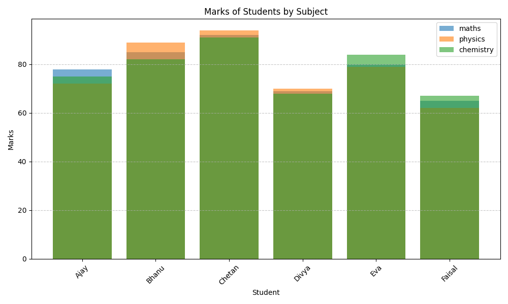
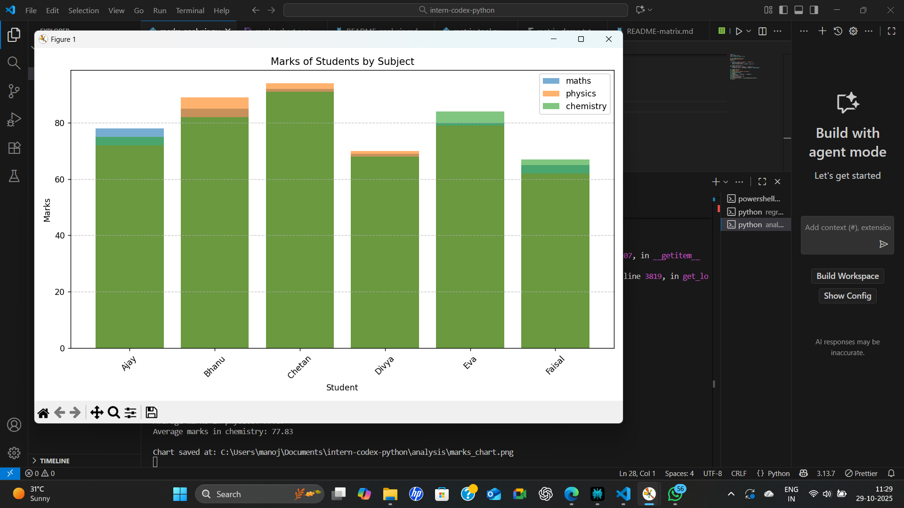

# Data Analysis: Student Marks

This task loads a CSV of student marks, calculates the average, and visualizes the data as a bar chart using Pandas and Matplotlib.

## How to Run

- Make sure `marks.csv` file is present in this folder

## Sample Output

**Average Marks:**  
The script prints the average marks in the terminal.

**Bar Chart:**  

**Terminal Output:**  

## Tools and Libraries Used

- Python 3.x
- pandas
- matplotlib
