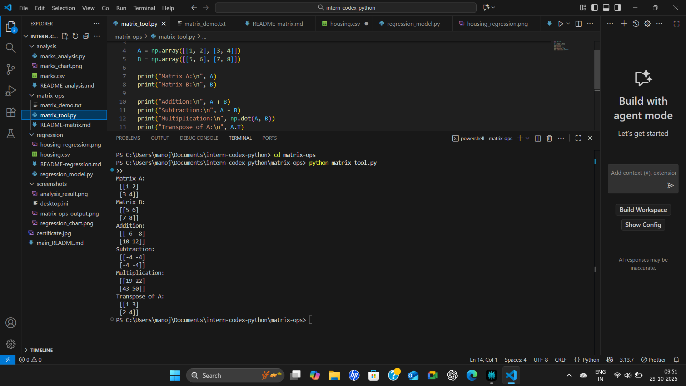

# Matrix Operations Tool

This script demonstrates several basic matrix operations using NumPy: addition, subtraction, multiplication, and transpose.

## How to Run

## Sample Output

Terminal output from the script showing matrix calculations:

See also `matrix_demo.txt` for detailed textual output.

## Tools and Libraries Used

- Python 3.x
- numpy
