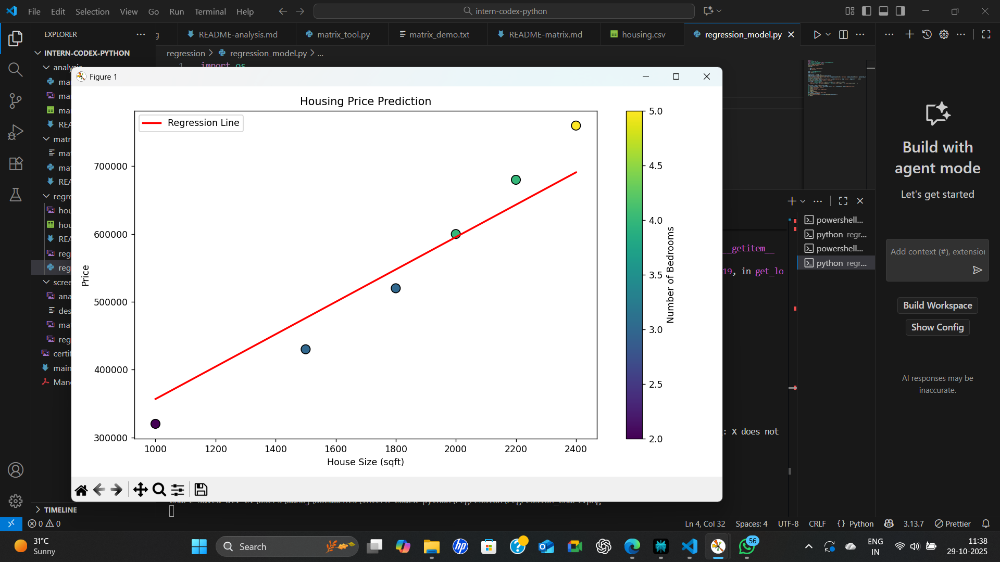
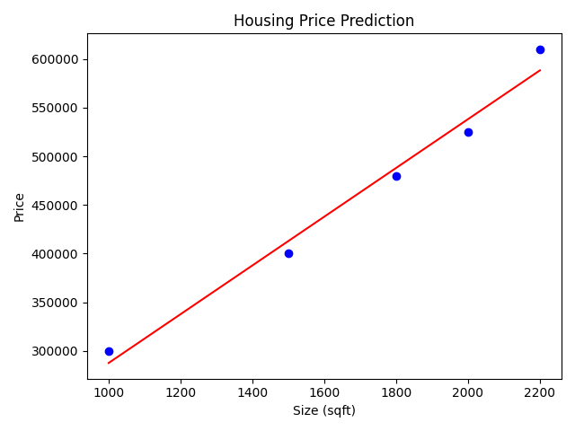

# Housing Price Prediction (Linear Regression)

This script predicts house prices based on the area (in square feet) using a linear regression model from scikit-learn, and visualizes the regression line with matplotlib.

## How to Run

- Make sure `housing.csv` is present in this folder

## Sample Output

**Regression Chart:**  

**Terminal Output:**  

## Methodology

- Data is loaded from a CSV file containing house size and price.
- A linear regression model is trained using scikit-learn.
- The model predicts house prices based on size.
- The scatter plot and regression line show the model fit.

## Tools and Libraries Used

- Python 3.x
- pandas
- matplotlib
- scikit-learn
